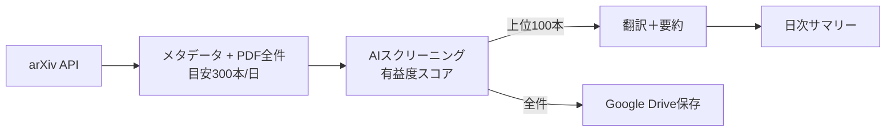

# arXiv論文日次収集＆翻訳システム - 実装計画

## 概要

arXivから指定分野（AI/機械学習/量子物理）の新着論文を毎日自動取得し、Gemini APIで日本語翻訳＆要約を行い、Google Driveに保存するシステム。

**ゴール**: Zero-Toil（完全自動化）でYouTubeショート素材＆NotebookLM活用を実現

---

## システム構成

```
📦 C:\Users\yke\Projects\entropic-aurora\
├── 📄 main.py                    # エントリーポイント（3段階パイプライン）
├── 📄 config.yaml                # 設定（カテゴリ、スクリーニング基準）
├── 📄 .env                       # API Keys（Git管理外）
├── 📄 requirements.txt
├── 📁 src/
│   ├── arxiv_client.py           # arXiv API取得
│   ├── pdf_downloader.py         # ⭐ PDF取得（全件300本）
│   ├── screener.py               # AIスクリーニング（翻訳対象選定）
│   ├── translator.py             # Gemini翻訳＋要約（バッチAPI）
│   ├── drive_uploader.py         # Google Drive連携
│   └── output.py                 # 出力処理
└── 📁 output/
```

---

## 技術スタック

| コンポーネント | 技術 | 理由 |
|--------------|------|------|
| 言語 | Python 3.11+ | AI/MLライブラリ充実 |
| arXiv取得 | `arxiv` ライブラリ | 公式推奨 |
| スクリーニング＆翻訳 | **Gemini 2.5 Flash バッチAPI** | **50%オフ** |
| PDF保存 | Google Drive API | NotebookLM連携 |
| 日次実行 | Windows Task Scheduler | Zero-Toil |

---

## 選択済みカテゴリ（確定・12カテゴリ）

### 🤖 AI・機械学習系（7カテゴリ）
`cs.AI`, `cs.LG`, `cs.CL`, `cs.CV`, `cs.NE`, `cs.RO`, `stat.ML`

### ⚛️ 物理系（5カテゴリ）
`quant-ph`, `cond-mat.dis-nn`, `hep-th`, `gr-qc`, `physics.comp-ph`

---

## データフロー（3段階パイプライン）



### 処理タイムライン
```
🌙 深夜2:00  → メタデータ取得 + PDF全件ダウンロード
🌙 深夜3:00  → スクリーニング + 翻訳バッチ投入
☀️ 朝7:00   → 結果取得完了
📊 朝7:30   → Drive保存 + サマリー生成
```

---

## Google Drive フォルダ構造（全データ保存）

```
📁 ArXiv/
├── 📁 2025-01/
│   ├── 📁 metadata/              # 全メタデータ
│   ├── 📁 screening/             # スクリーニング結果
│   ├── 📁 translated/            # 翻訳結果（上位100本/日）
│   ├── 📁 papers/                # PDF全件
│   └── 📄 summary_*.md           # 日次サマリー
└── 📁 2025-02/
```

---

## コスト試算（月額）

| Phase | 処理内容 | 月額 |
|-------|---------|------|
| 1 | メタデータ + PDF全件取得 | 無料 |
| 2 | AIスクリーニング | $1.5 |
| 3 | 翻訳（上位100本） | $4.8 |
| **Gemini API合計（バッチAPI 50%オフ）** | | **$6.3/月** |
| **PDFストレージ（目安300本×2MB×30日）** | | **約18GB/月** |

| 項目 | 月額 |
|------|------|
| Google AI Pro | $19.99 |
| Gemini API | $6.3 |
| クレジット相殺 | -$10 |
| **実質合計** | **約$16/月** |

---

## 実装優先順位

1. **MVP**: arXiv取得 → コンソール出力
2. **スクリーニング**: Geminiで有益論文選定
3. **翻訳**: バッチAPIで100本翻訳
4. **Drive連携**: PDF＆サマリー保存
5. **自動化**: Task Scheduler設定

---

## リスクと対策

| リスク | 対策 |
|--------|------|
| arXiv API制限 | リクエスト間隔を3秒以上空ける |
| Gemini API障害 | リトライ処理（指数バックオフ） |
| 認証期限切れ | サービスアカウント使用（長期有効） |
