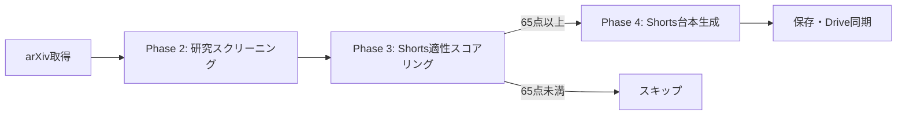

# YouTube Shorts 台本生成システム - 設計改善案 v2

> **レビューフィードバック反映版**
> - weights優先順位をShorts特化に変更
> - 第6軸「life_impact」追加
> - clickbait判定を「強制タイトル生成→採点」方式に変更
> - CTAを「余韻」に変更
> - min_scoreを65に変更

---

## 新パイプライン設計



---

## 1. 評価基準（100点満点）- Shorts特化版

### 🔥 優先順位（再生数ベース）

```
① clickbait_potential  25点  ← 「止まるか」が最優先
② life_impact          20点  ← 仕事・生活への脅威
③ human_comparison     20点  ← 人間 vs AI
④ strong_numbers       15点  ← 数字インパクト
⑤ use_case            10点  ← 用途の具体性
⑥ implementation      10点  ← 実装現実性
─────────────────────────────
合計                  100点
```

---

## 2. Shorts適性スコアリング プロンプト

### `src/shorts_scorer.py`

```python
SHORTS_SCORING_PROMPT = """
あなたはYouTube Shortsの編集者です。
以下の論文が「30秒Shorts」として再生されやすいか評価してください。

## 評価基準（100点満点）

### 1. 煽りタイトル変換可能性 (最大25点) 【最重要】
まず、以下の形式でタイトルを3案作成してください：
- 「◯◯が終わる」形式
- 「人間不要」「もう◯◯しなくていい」形式
- その他インパクト形式

その上で評価：
- 嘘にならず強いタイトルが作れる: 25点
- 作れるが少し誇張が必要: 15点
- 正直に作ると弱い: 5点
- 煽れない: 0点

### 2. 人生・仕事への影響度 (最大20点)
この研究が普及した場合、一般人の仕事・判断・生活に直接影響があるか？
- 仕事がなくなる/大きく変わる: 20点
- 生活に影響: 12点
- 専門家のみ影響: 5点
- 影響なし: 0点

### 3. 人間・専門家との比較 (最大20点)
"human", "expert", "doctor", "professional" との比較実験があるか
- 人間を上回る結果あり: 20点
- 比較実験あり: 12点
- 言及のみ: 5点
- なし: 0点

### 4. 数字インパクト (最大15点)
精度90%+、速度10倍+、コスト50%減など
- 衝撃的な数字あり: 15点
- 良い数字あり: 8点
- 普通/なし: 0点

### 5. 用途の具体性 (最大10点)
医療、法律、教育、プログラミングなど明確な分野
- 生活に近い分野: 10点
- 専門分野: 5点
- 抽象的: 0点

### 6. 実装の現実性 (最大10点)
- 今すぐ使える: 10点
- 近い将来: 5点
- 遠い/研究段階: 0点

## 論文情報
タイトル: {title}
アブストラクト: {abstract}

## 出力形式（JSON）
{{
    "clickbait_potential": {{
        "score": <0-25>,
        "generated_titles": ["タイトル案1", "タイトル案2", "タイトル案3"],
        "best_title": "<最も使えるタイトル>",
        "is_honest": true/false
    }},
    "life_impact": {{"score": <0-20>, "affected_jobs": ["職種1", ...], "reason": "..."}},
    "human_comparison": {{"score": <0-20>, "found_keywords": [...], "evidence": "..."}},
    "strong_numbers": {{"score": <0-15>, "numbers": ["95%", ...], "evidence": "..."}},
    "use_case": {{"score": <0-10>, "domains": ["医療", ...]}},
    "implementation": {{"score": <0-10>, "availability": "open-source/API/未公開"}},
    "total_score": <合計点>,
    "verdict": "ADOPT_HIGH" / "ADOPT_MID" / "SKIP",
    "one_line_hook": "<Shorts冒頭の一言（15字以内）>"
}}

### verdict 判定ロジック

```python
def judge_verdict(total_score: int) -> str:
    if total_score >= 80:
        return "ADOPT_HIGH"   # 高品質候補
    elif total_score >= 65:
        return "ADOPT_MID"    # 動画化対象
    else:
        return "SKIP"         # スキップ
```

※ Geminiにはverdictの計算をさせず、total_scoreからPython側で判定
"""
```

---

## 3. Shorts 30秒台本プロンプト

### `src/shorts_writer.py`

```python
SHORTS_SCRIPT_PROMPT = """
あなたはYouTube Shortsの人気クリエイターです。
以下の論文を30秒のShorts台本に変換してください。

## 構成ルール（6ブロック・各5秒）

### ブロック1: フック（0-5秒）
- 視聴者が「え？」と思う一言
- 例: 「もう医者いらないかも」「プログラマー、終わりです」

### ブロック2: 問題提起（5-10秒）
- 現状の課題や常識を提示
- 例: 「今までCTスキャンの読影は医師が何時間もかけてた」

### ブロック3: 解決策（10-15秒）
- このAI/技術が何をするか
- 例: 「このAIは3秒で診断、しかも精度95%」

### ブロック4: 証拠（15-20秒）
- 数字やデータで裏付け
- 例: 「専門医と比較して、なんと上回る正答率」

### ブロック5: 影響（20-25秒）
- これが広まるとどうなるか
- 例: 「途上国の医療格差が一気に解消されるかも」

### ブロック6: 余韻（25-30秒）【変更】
- 断定や不安を残す一言
- 例: 「これ、もう止まらない」「気づいた時には遅いかも」
- ※フォロー誘導はしない（概要欄・固定コメントで対応）

## 論文情報
タイトル: {title}
アブストラクト: {abstract}
Shortsスコア: {shorts_score}
煽りタイトル: {best_title}

## 出力形式（JSON）
{{
    "video_title": "<YouTube動画タイトル（40字以内）>",
    "thumbnail_text": "<サムネイル用テキスト（10字以内）>",
    "blocks": [
        {{"block": 1, "type": "フック", "script": "...", "visual_note": "..."}},
        {{"block": 2, "type": "問題提起", "script": "...", "visual_note": "..."}},
        {{"block": 3, "type": "解決策", "script": "...", "visual_note": "..."}},
        {{"block": 4, "type": "証拠", "script": "...", "visual_note": "..."}},
        {{"block": 5, "type": "影響", "script": "...", "visual_note": "..."}},
        {{"block": 6, "type": "余韻", "script": "...", "visual_note": "..."}}
    ],
    "full_script": "<全文ナレーション>",
    "hashtags": ["#AI", "#論文解説", ...]
}}
"""
```

---

## 4. 統合CSV設計（papers_*.csv）

| グループ | 列 |
|---------|-----|
| 基本情報 | id, title, authors, categories, published |
| 研究スコア | total_score, usefulness, novelty, impact, explainability |
| **Shortsスコア** | shorts_score, clickbait, life_impact, human, numbers, use_case, impl |
| **生成結果** | verdict, best_title, one_line_hook |
| その他 | abstract, pdf_url |

---

## 5. config.yaml

```yaml
shorts:
  min_score: 65        # 初期値：多めに回す
  max_scripts: 10
  weights:
    clickbait_potential: 25
    life_impact: 20
    human_comparison: 20
    strong_numbers: 15
    use_case: 10
    implementation: 10
```

---

## 6. 実装優先順位

| 優先度 | タスク | 工数 |
|-------|--------|-----|
| 🔴 P0 | `shorts_scorer.py` 実装 | 1h |
| 🔴 P0 | `shorts_writer.py` 実装 | 1h |
| 🟡 P1 | `main.py` Phase 3-4追加 | 30m |
| 🟢 P2 | テスト・閾値調整 | 30m |
